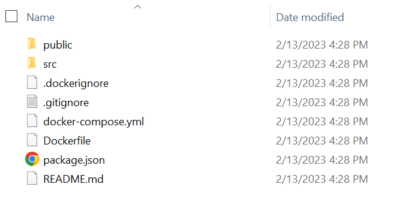

# odoo-challenge-frontend
Odoo Challenge Frontend

## Introduction
In this tutorial you will deploy odoo challenge frontend based on Reeact.Js

## Prerequisite
Ubuntu 18 or above

### SSH into Cloud Server
ssh -i "server-key.pem" username@SERVER_IP

### Step 1 — Installing Docker Compose
To install the docker-compose command line tool, refresh your package list, then install the package using apt:

sudo apt update
sudo apt install docker-compose

You can confirm that the package is installed by running the following command:

docker-compose –-version

You should receive output like the following:

Output
docker-compose version 1.29.2, build unknown

Once you have confirmed that Docker Compose is installed on your server, you will configure and launch Odoo and PostgreSQL using Docker Compose in the next step of this tutorial.

### Step 2 — Create a container image.
To create the container image, you need to create a Docker file in the root directory of the React app. The Docker file contains instructions for generating the container image. The following is an example of what the Docker file might look like.

Create a dockerfile with following contents:
nano dockerfile
`
# Use an official Node runtime as a parent image
FROM node:20-alpine

# Set the working directory to /app
WORKDIR /app

# Copy the package.json and package-lock.json to the working directory
COPY ./package*.json ./

# Install the dependencies
RUN npm install

# Copy the remaining application files to the working directory
COPY . .

# Build the application
RUN npm run build

# Expose port 3000 for the application
EXPOSE 5173

# Start the application
#CMD [ "npm", "run", "start" ]
# Start development server
CMD ["npm", "run", "dev", "--", "--host", "0.0.0.0"]

`
As per the configuration, Docker will copy the React app into the app container folder. During the creation of the React app, the node module files will be installed automatically. You can also keep these files or directories from being copied to the container using the dockerignore file.

Create a .dockerignore file with following:

nano .dockerignore
`
// .dockerignore file
 
node_modules
Dockerfile
.git
.gitignore
.dockerignore
`

Create .env file with:
Make sure you use server IP:port or server domain.
nano .env
`
VITE_API_BASE_URL=http://127.0.0.1:8069
or 
VITE_API_BASE_URL=SERVER_DOMAIN
`

### Step 3: Build a Docker container using Docker Compose.
Now, we’ll build a Docker container using the Docker Compose tool, designed to define and operate multi-container Docker apps. With just a single command, Docker Compose provides an easy way to set up and launch a group of connected containers.

To utilize Docker Compose, create a docker-compose.yml file and specify your app’s services, networks, and volumes.

Refer to the following code example.

nano docker-compose.yml
Create a docker-compose.yml file with following:

`
version: "3"
services:
  react-app:
    build: .
    ports:
      - "5173:5173"  # Vite default port
    environment:
      - NODE_ENV=development
      - VITE_API_URL=http://localhost:8069  # Your Odoo backend URL
    volumes:
      - .:/app  # Mount current directory to /app in container
      - /app/node_modules  # Keep node_modules in container
    stdin_open: true  # Docker equivalent of -i
    tty: true        # Docker equivalent of -t
`
### Step 4: Run the Docker container.
Finally, run the Docker container using the following Docker Compose command.

Docker-compose up -d
Now, you can check the container status in the Docker Desktop app’s container tab.Run the Docker container

The React application will be accessible at http://localhost:5173/, and the output will look like the following image.

